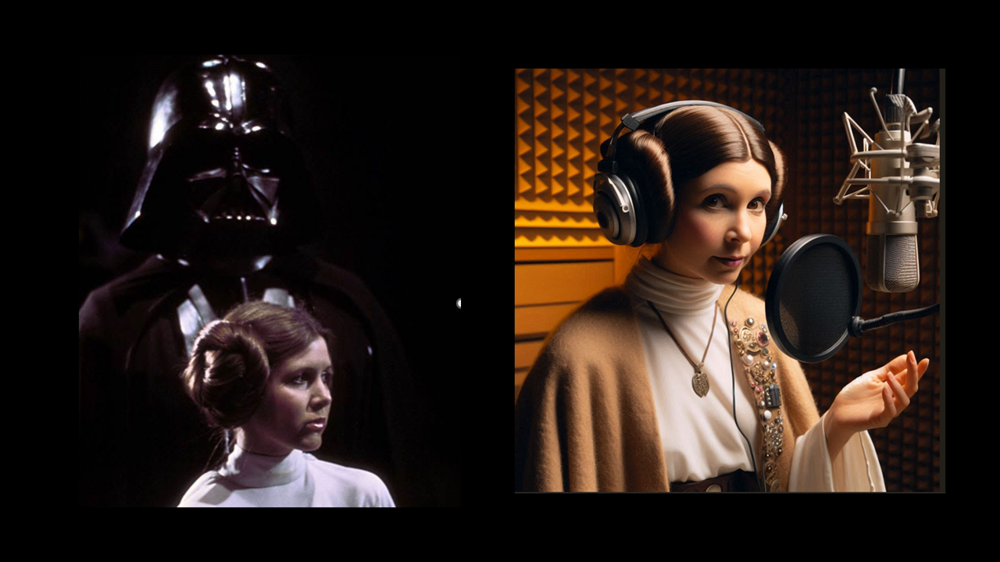

# Projeto Podcast Gerado por I.A.s

Projeto com o objetivo de gerar um podcast utilizando ferramentas de IA através de prompts mais trabalhado.

Utilizer uma esteira de prompts para gerar cada etapa do processo criativo.

## 💻 Tecnologias utilizadas no projeto

- [ChatGPT](https://chat.openai.com/) 
- [Copilot](https://www.bing.com/images/create?FORM=IRPGEN/)
- [ElevenLabs](https://beta.elevenlabs.io/)
- [Capcut](https://www.capcut.com/pt-br/)

## ✨ Como foi feito ?

- Roteiro gerado via chatgpt
- Audio gerado pela elevenLabs
- Copilot Para gerar capas
- Capcut para tratar aúdio e adicionar sons de fundo

## 📚 Materiais

- [Editor de aúdio](https://www.capcut.com/editor?from_page=landing_page&__action_from=picture_V%C3%ADdeos%20profissionais%20em%20minutos,%20n%C3%A3o%20em%20horas.)
- [Visual Studio Code](https://code.visualstudio.com/)

## 🛠️ Instruções de Execução

Para organizar o projeto, utilize os prompts dentro do Visual Studio Code seguindo o passo a passo abaixo:

1. 🤖 Utilize os prompts de roteiro no ChatGPT.
2. 🤖 Aplique os prompts de roteiro gerados pelo ChatGPT no ElevenLabs.
3. 🎨 Utilize os prompts de artes no Copilot.

Esses passos garantirão uma execução organizada e eficiente do projeto.

## 👨‍💻 Expert
    

    <a 
        href="https://www.linkedin.com/in/rozvania">
        LinkedIn
    </a>
    
   

  

